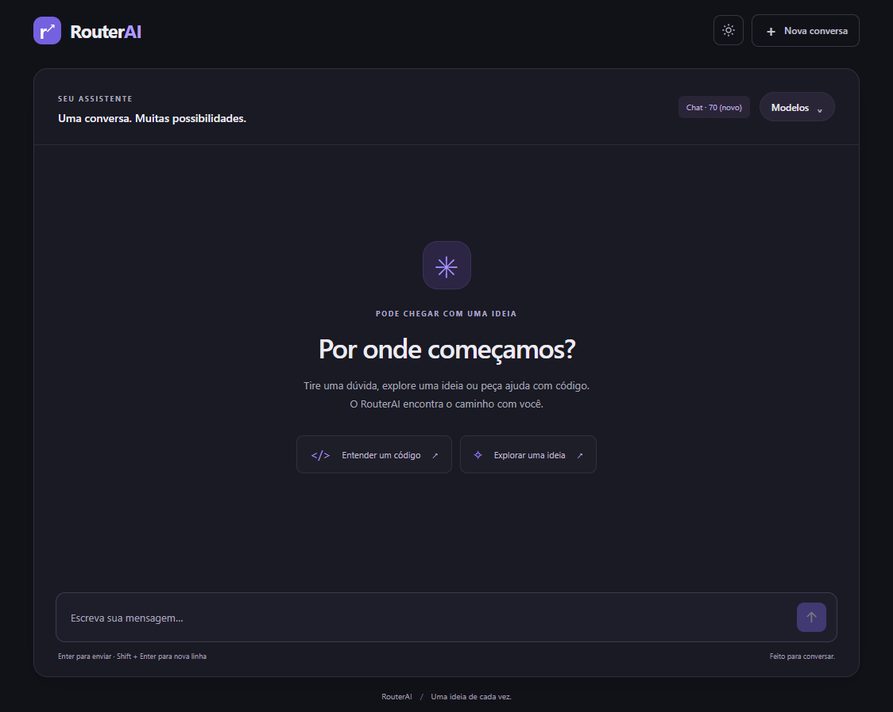

# RouterAI

RouterAI é um chat de IA que identifica o tipo de tarefa e direciona a mensagem para um agente geral, de matemática ou de programação.

O projeto nasceu da ideia de aproveitar modelos de linguagem pequenos (SLMs) em hardware limitado. Ele reúne os modelos em uma interface, com roteamento automático de agentes e escolha manual do modelo de resposta.

## Interface



## Features

- Roteamento automático entre agentes com classificação em JSON Schema.
- Conversas com histórico persistido em SQLite e usado como contexto.
- Escolha e troca do modelo de resposta durante a conversa.
- Modelo atual salvo por chat, independentemente do agente e de seu prompt.
- Lista de modelos com cache em memória no frontend e atualização manual.
- Interface com Markdown, tema claro/escuro e restauração da conversa na mesma aba.

## Stack utilizada

- **Backend:** Python, FastAPI, Pydantic, Uvicorn, SQLite, python-dotenv e cliente OpenAI.
- **Frontend:** HTML, CSS, JavaScript, Marked e DOMPurify, sem build.
- **Servidor de IA:** endpoint compatível com a API da OpenAI, configurado no `.env`. Os scripts de preparação usam o LM Studio.

O roteador ativo e a geração de respostas usam o cliente OpenAI. O pacote `lmstudio` permanece em `requirements.txt`, mas não é utilizado nesses caminhos ativos.

## Como funciona

1. O frontend envia a mensagem, o ID do chat e a seleção de modelo, que pode ser `null`.
2. Na criação, o roteador escolhe o agente: `general`, `matematico` ou `coder`.
3. O backend salva o agente e o modelo selecionado. Sem seleção, salva o modelo padrão do agente definido em `agents/modelos.json`.
4. A geração recebe o histórico e o prompt do agente, usando o modelo vinculado ao chat.
5. Nas mensagens seguintes, o backend consulta o agente e o modelo salvos. Uma seleção diferente atualiza o modelo antes da geração; ausência de seleção mantém o salvo.
6. Chats com agente `general` são reclassificados nas mensagens seguintes e podem mudar de agente. Essa mudança altera o prompt, preservando o modelo da conversa.

Selecionar um modelo no menu prepara a escolha; enviar a próxima mensagem efetiva a troca. O modelo usado pelo roteador continua sendo o configurado em `agents/modelos.json`.

## Requisitos

- Windows, Git e Python 3.10 ou superior.
- Servidor compatível com a API da OpenAI disponível e com os modelos necessários.
- Endpoint e chave de acesso no `.env`, seguindo `.env.example`. A chave deve ser não vazia, inclusive para um servidor local. Não versionar esse arquivo.

## Como executar

Execute os comandos a partir da raiz do repositório.

```powershell
git clone https://github.com/ItsDrue157/RouterAI.git
cd RouterAI
```

Prepare o `.env` antes de iniciar. Para a configuração local com LM Studio, abra o aplicativo e execute:

```powershell
.\setup_models.bat
```

Esse script baixa `qwen/qwen3-1.7b` e `qwen/qwen3-4b-2507` e tenta iniciar o servidor na porta 1234. Confira os IDs em `agents/modelos.json` e o endpoint do `.env`.

Na primeira execução:

```powershell
.\setup.bat
```

O script instala `uv` se necessário, cria `.venv`, instala as dependências, inicializa os bancos e chama o inicializador.

Nas próximas execuções:

```powershell
.\start.bat
```

- Frontend: [http://127.0.0.1:5000](http://127.0.0.1:5000).
- API: [http://127.0.0.1:8000](http://127.0.0.1:8000).
- Documentação interativa: [http://127.0.0.1:8000/docs](http://127.0.0.1:8000/docs).

O inicializador verifica o LM Studio na porta 1234, mas uma falha nessa verificação apenas gera um aviso. As requisições usam o servidor configurado no `.env`.

Para inicializar somente os bancos:

```powershell
.\init_db.bat
```

## API Reference

URL base: `http://127.0.0.1:8000`.

As duas rotas de chat recebem:

| Campo | Tipo | Descrição |
| --- | --- | --- |
| `chat_id` | `integer` | Identificador do chat, fornecido pelo frontend. |
| `input` | `string` | Mensagem do usuário. |
| `modelo` | `string \| null` | Opcional, com padrão `null`. Identificador do modelo de resposta. |

Na criação, omitir `modelo` ou enviar `null` usa o padrão do agente. Em um chat existente, mantém o modelo salvo. Uma string diferente troca o modelo na próxima geração. A escolha deve corresponder a um ID retornado por `GET /models`; o backend atualmente não valida esse ID consultando a lista antes da geração.

### Criar um chat — `POST /chat`

Classifica a primeira mensagem, cria o registro quando o ID ainda não existe, salva a mensagem e gera a resposta.

```json
{
  "chat_id": 1,
  "input": "Como faço uma API em Python?",
  "modelo": "qwen/qwen3-4b-2507"
}
```

Resposta atual:

```json
{
  "chat_id": 1,
  "reply": "Resposta gerada pelo agente"
}
```

Use um ID novo para iniciar uma conversa. Essa rota ainda não oferece tratamento completo de repetição de requisições: reutilizar um ID pode reaproveitar o histórico existente, e repetir o envio pode duplicar mensagens.

### Continuar um chat — `POST /chat/message`

Consulta o agente e o modelo salvos e usa o histórico como contexto. Uma troca de modelo é confirmada no banco antes da tentativa de gerar a resposta.

```json
{
  "chat_id": 1,
  "input": "Explique essa implementação",
  "modelo": "qwen/qwen3-1.7b"
}
```

Para continuar com o modelo salvo:

```json
{
  "chat_id": 1,
  "input": "Pode dar outro exemplo?",
  "modelo": null
}
```

Resposta atual:

```json
{
  "reply": "Resposta gerada pelo agente"
}
```

Um chat inexistente retorna HTTP 404:

```json
{
  "detail": "chat não encontrado"
}
```

Falhas de SQLite e de geração ainda não têm um contrato de erro específico. Se a geração falhar depois de uma troca, o novo modelo permanece salvo; não há fallback automático. A mensagem do usuário também pode já estar salva, portanto repetir o envio pode duplicá-la no histórico.

### Listar modelos — `GET /models`

Consulta o servidor de IA configurado e retorna seus IDs:

```json
{
  "models": ["qwen/qwen3-1.7b", "qwen/qwen3-4b-2507"]
}
```

O frontend consulta na primeira abertura do menu e guarda a lista em memória. Reabrir usa o cache; **Atualizar lista** força outra consulta. Recarregar a página limpa esse cache. Uma atualização que falha preserva a última lista obtida.

### Modelo nas respostas: limitação atual

As respostas da API ainda não incluem `modelo`. O frontend já está preparado para recebê-lo e persisti-lo, inclusive em um erro de geração que confirme a escolha salva.

Com o contrato atual, uma seleção explícita é restaurada após um envio bem-sucedido. Porém, o frontend não descobre o modelo padrão escolhido pelo backend nem confirma, após uma falha, que uma troca foi salva. Essa integração continua no TODO.

## Persistência e estado local

- `db/users.db`: tabela `chats`, com `chat_id`, `agente`, `modelo TEXT NOT NULL` e `criado_em`.
- `db/messages.db`: mensagens com papel e conteúdo, consultadas em ordem para montar o contexto.
- `sessionStorage`: conversa atual, estado de criação e modelo confirmado na mesma aba.
- `localStorage`: contador de IDs de chat para testes locais.
- Logs em `logs/routerai.log`; `main.py` cria o diretório quando necessário.

Não existe migração automática: `CREATE TABLE IF NOT EXISTS` não acrescenta `modelo` a bancos antigos. Um banco anterior a essa alteração precisa ser migrado ou recriado conscientemente. Recriar os dados de teste exige manter chats e mensagens coerentes e perde o histórico removido.

IDs nascem no frontend. Outros navegadores, origens ou limpeza do armazenamento podem reutilizar IDs existentes. Não há login nem verificação de propriedade dos chats.

## Frontend e verificações

O frontend está em `RouterAI- frontend/`; veja seu [README](<RouterAI- frontend/README.md>) para detalhes de integração.

O timeout de chat é de 180 segundos e o de listagem de modelos é de 10 segundos. O CORS permite frontend em `localhost` e `127.0.0.1`, nas portas 5000 e 5500.

Não há suíte automatizada configurada. `tests/teste_sql.py` é um diagnóstico manual com ID fixo, sem assertions. Para verificar a integração, teste criação com e sem seleção, troca durante o chat, continuidade sem nova seleção, recarga, nova conversa e atualização da lista. A restauração do modelo padrão e a confirmação de trocas após falha dependem da pendência descrita acima.

## V2

- [x] ✅ Criar o seletor visual de modelos na interface.
- [x] ✅ Mover o endpoint e a chave de API para o `.env`.
- [x] ✅ Usar o modelo selecionado na geração das respostas, permitindo trocas durante a conversa e salvando a escolha no chat.
- [x] ✅ Guardar a lista de modelos em memória no frontend e permitir atualização manual.
- [x] ✅ Limpar a seleção ao iniciar uma nova conversa e restaurar o modelo confirmado ao recarregar a página.
- [ ] Retornar o modelo salvo nas respostas da API, inclusive em erros de geração, para restaurar o modelo padrão e confirmar trocas que falharam.
- [ ] Criar login e vincular chats e histórico a cada conta.
- [ ] Reestruturar o core e integrar o novo fluxo de roteamento.
- [ ] Permitir prompts personalizados para novos agentes.
- [ ] Exibir indicadores de desempenho dos modelos com benchmarks locais.
- [ ] Validar APIs externas e adicionar fallback entre modelos.
- [ ] Ajustar o contexto ao limite de cada modelo e selecionar o histórico relevante.
